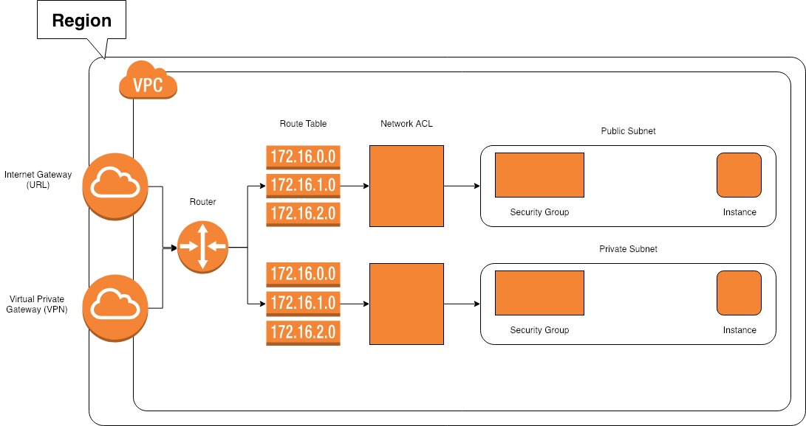

# VPC
Virtual data center in the cloud.

Table Of Contents
 - [What is Amazon VPC?](#What-is-Amazon-VPC)

# What is Amazon VPC?
Amazon Virtual Private Cloud (VPC) creates a private isolated section of the AWS cloud where you can launch AWS resources in your own personal virtual network.  This gives you complete control over the environment including IP address ranges, supbnets, route tables, and netwark gateways.  You can also create a VPN Connection

AWS gives you default account.

